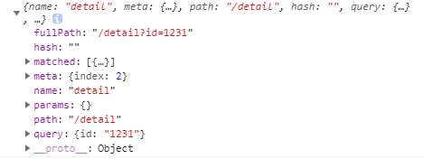

#### 1、第一种方式

组件A

```js
   <router-link :to='{path:"/detail",query:{id:id}}'>
        test
    </router-link>
   
    data(){
        return {
            id:1231,
        }
    }
```

组件B

```js
 created(){
        console.log(this.$route);// query.id = 1231
    }
```

打印结果：



#### 2、第二种方式

使用router的钩子函数

```js
beforeRouteEnter (to, from, next) {
        // console.log(to);
        // console.log(1111);
        // 不！能！获取组件实例 `this`
        // 因为当钩子执行前，组件实例还没被创建
        // 请求详细数据
        $http({
            url: `/api/4/news/${to.params.id}`,
            success(res){
                // console.log(res);
                next(vm => vm.res = res);
                Indicator.close();
            }
        });        

    },
```

<全文结束>