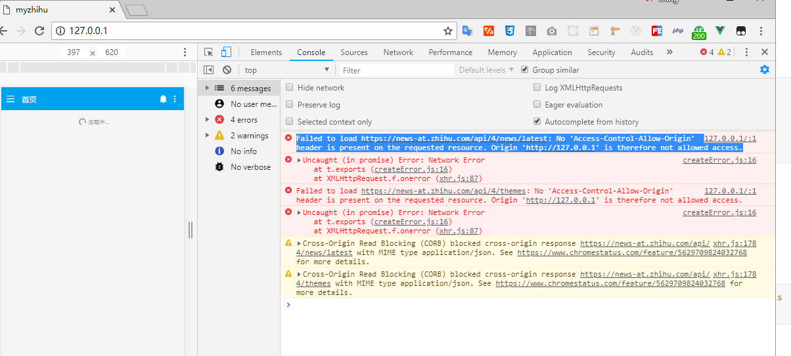

### 一、开发时的跨域解决

#### 1、webpack中的设置

在config/index.js文件中设置：

```js
    proxyTable: {
      '/api': {
        // target: 'http://wx.4006188666.com/api/', //设置调用接口域名和端口号别忘了加http
        target: 'http://news-at.zhihu.com/api/',  // 知乎日报
        // target: 'http://zhihuapi.herokuapp.com/api',
        changeOrigin: true,
        pathRewrite: {
          '^/api': '/' //这里理解成用‘/api’代替target里面的地址，组件中我们调接口时直接用api代替
          // 比如我要调用'http://0.0:300/user/add'，直接写‘/api/user/add’即可
        }
      }
    },
```

使用代理映射开启虚拟跨域。

#### 2、使用

在 api.js文件中：

```js
export const getNews = () => {
    var random = ("?v=" + Math.random()).replace(".","");
    return axios.get('/api/4/news/latest'+random).then(res => res.data);
}
```

请求为：


会被映射为实际的URL。


### 二、生产环境中

```js
axios.defaults.baseURL = 'https://news-at.zhihu.com/';

axios.defaults.header = {
    "Access-Control-Allow-Origin":"*",
};
```


### 三、问题

我将VUE中dist放在phpstatdy中通过127.0.0.1访问。

报错：

```js
Failed to load https://news-at.zhihu.com/api/4/news/latest: No 'Access-Control-Allow-Origin' header is present on the requested resource. Origin 'http://127.0.0.1' is therefore not allowed access.
```




<全文结束>