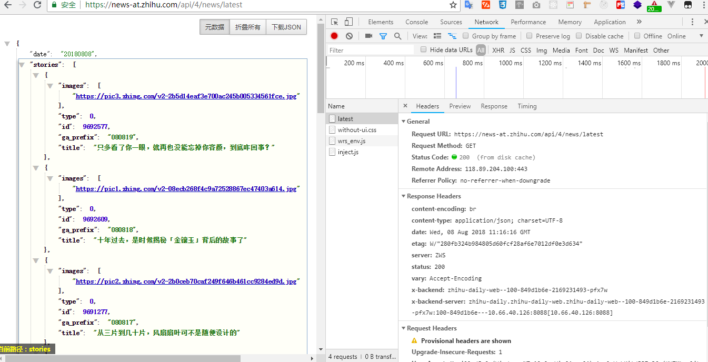
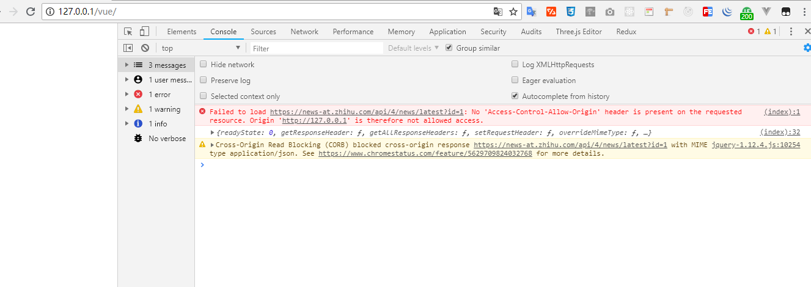
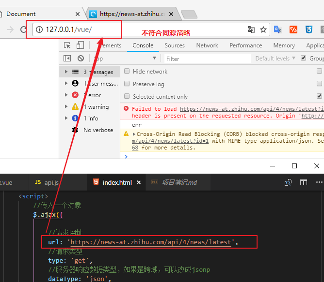

> 参考：http://www.ruanyifeng.com/blog/2016/04/cors.html

#### 1、问题引入

我想要访问这样一个网址：

```js
https://news-at.zhihu.com/api/4/news/latest
```

在浏览器中输入网址后得到结果：



我想在我的网页中使用这个数据，于是在index.html网页中使用jquery获取数据：

```js
 //传入一个对象
        $.ajax({
            //请求网址
            url: 'https://news-at.zhihu.com/api/4/news/latest',
            //请求类型
            type: 'get',
            //服务器响应数据类型，如果是跨域，可以改成jsonp
            dataType: 'json',
            //发送给服务器的数据（请求体）,如果是get请求数据写在url,如果是post才写data属性
            data: { id: 1 },
            //回调函数：响应回来调用的函数
            success: function (data) {
                console.log(data)
            },
            //请求失败触发
            error: function (err) {
                console.log(err)
            }
        })
```

这个index.html通过文件协议可以正常获取数据,直接双击打开就行。现在我要部署上线。
放在phpstudy的WWW目录下，通过http协议访问。于是报错：

```js
Failed to load https://news-at.zhihu.com/api/4/news/latest?id=1: No 'Access-Control-Allow-Origin' header is present on the requested resource. Origin 'http://127.0.0.1' is therefore not allowed access.
```



#### 2、同源跨域

上面报错的原因是违背了浏览器的同源策略。

地址栏中的URL和请求内容URL进行对比,必须是协议/url/端口号都相同才能称为同源。才允许访问。



开发时可以使用代理服务器映射,在vue-cli中设置。


#### 3、同源跨域的过程

##### 1)、两种请求

浏览器将CORS请求分成两类：简单请求（simple request）和非简单请求（not-so-simple request）。

只要同时满足以下两大条件，就属于简单请求。

> （1) 请求方法是以下三种方法之一：
>
> - HEAD
> - GET
> - POST
>
> （2）HTTP的头信息不超出以下几种字段：
>
> - Accept
> - Accept-Language
> - Content-Language
> - Last-Event-ID
> - Content-Type：只限于三个值`application/x-www-form-urlencoded`、`multipart/form-data`、`text/plain`

凡是不同时满足上面两个条件，就属于非简单请求。

浏览器对这两种请求的处理，是不一样的。

##### 2) 、简单请求过程

对于简单请求，浏览器直接发出CORS请求。具体来说，就是在头信息之中，增加一个`Origin`字段。

下面是一个例子，浏览器发现这次跨源AJAX请求是简单请求，就自动在头信息之中，添加一个`Origin`字段。

> ```
> GET /cors HTTP/1.1
> Origin: http://api.bob.com
> Host: api.alice.com
> Accept-Language: en-US
> Connection: keep-alive
> User-Agent: Mozilla/5.0...
>
> ```

上面的头信息中，`Origin`字段用来说明，本次请求来自哪个源（协议 + 域名 + 端口）。服务器根据这个值，决定是否同意这次请求。

如果`Origin`指定的源，不在许可范围内，服务器会返回一个正常的HTTP回应。浏览器发现，这个回应的头信息没有包含`Access-Control-Allow-Origin`字段（详见下文），就知道出错了，从而抛出一个错误，被`XMLHttpRequest`的`onerror`回调函数捕获。注意，这种错误无法通过状态码识别，因为HTTP回应的状态码有可能是200。

如果`Origin`指定的域名在许可范围内，服务器返回的响应，会多出几个头信息字段。

> ```
> Access-Control-Allow-Origin: http://api.bob.com
> Access-Control-Allow-Credentials: true
> Access-Control-Expose-Headers: FooBar
> Content-Type: text/html; charset=utf-8
>
> ```

上面的头信息之中，有三个与CORS请求相关的字段，都以`Access-Control-`开头。

**（1）Access-Control-Allow-Origin**

该字段是必须的。它的值要么是请求时`Origin`字段的值，要么是一个`*`，表示接受任意域名的请求。

**（2）Access-Control-Allow-Credentials**

该字段可选。它的值是一个布尔值，表示是否允许发送Cookie。默认情况下，Cookie不包括在CORS请求之中。设为`true`，即表示服务器明确许可，Cookie可以包含在请求中，一起发给服务器。这个值也只能设为`true`，如果服务器不要浏览器发送Cookie，删除该字段即可。

**（3）Access-Control-Expose-Headers**

该字段可选。CORS请求时，`XMLHttpRequest`对象的`getResponseHeader()`方法只能拿到6个基本字段：`Cache-Control`、`Content-Language`、`Content-Type`、`Expires`、`Last-Modified`、`Pragma`。如果想拿到其他字段，就必须在`Access-Control-Expose-Headers`里面指定。上面的例子指定，`getResponseHeader('FooBar')`可以返回`FooBar`字段的值。

<全文结束>


