# 1. git

## 1.1. 学习目标

- 理解
  - 常用bash系统命令
  - git 的概念
  - git 和 svn 的区别
  - git 的工作流程
  - git 管理文件版本
  - 使用远程仓库
  - 分支管理
  - 冲突
- 应用


## 1.2. 认识命令行 了解

### 1.2.1. shell

​	**Shell** 俗称壳（用来区别于核），是指“提供使用者使用界面”的软件（命令解析器）

如

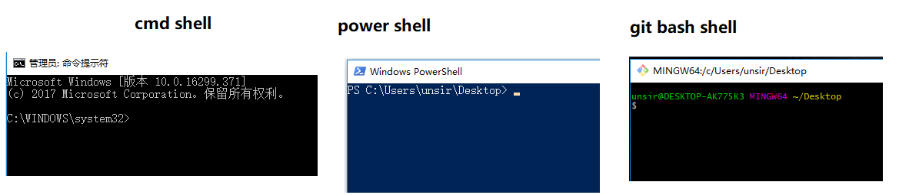

​	cmd shell 是系统提供的最基本的shell，功能也相对基础。

​	powser shell 和 git bash shell 可以理解是对 cmd shell 的一层封装，提供了更为强大的命令。

​	我们平常在系统上所进行的操作，如新增文件，编辑文件，删除文件等。其实底层都是通过一系列的命令来执行的。

### 1.2.2. 常见bash命令

```bash
pwd (Print Working Directory) 查看当前目录

cd (Change Directory) 切换目录，如 cd /etc

ls (List) 查看当前目录下内容，如 ls 

mkdir (Make Directory) 创建目录，如 mkdir blog

touch 创建文件，如 touch index.html

cat 查看文件全部内容，如 catindex.html

rm (remove) 删除文件，如 rm index.html、rm -rf  blog

rmdir (Remove Directory) 删除文件夹，只能删除空文件夹，不常用

mv (move) 移动文件或重命名，如 mv index.html ./demo/index.html

cp (copy) 复制文件，cp index.html ./demo/index.html

head 查看文件前几行，如 head -5 index.html

history 查看操作历史

whoami 查看当前用户
```

【注意】，在命令行当中 使用快捷键 进行复制粘贴都是没有效果的。

- ctrl + p 没有效果
- ctrl + c  强制退出到 命令行当中

### 1.2.3. vi编辑器

- vi编辑器是Linux和Unix上最基本的文本编辑器。由于不需要图形界面，vi是效率很高的文本编辑器
- vi编辑器提供了3种模式，分别是命令模式、插入模式、末行模式 每种模式有不同的功能

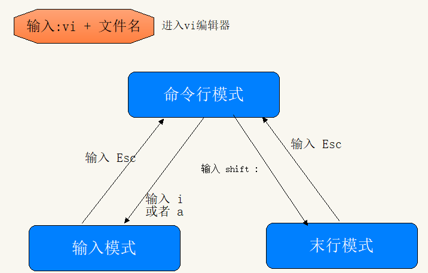

```bash
a) 打开/创建文件， vi 文件路径
b) 末行模式 :w保存，:w filenme另存为
c) 末行模式 :q退出
d) 末行模式 :wq保存并退出
e) 末行模式 :e! 撤销更改，返回到上一次保存的状态
f) 末行模式 :q! 不保存强制退出

================================================================

h) 命令模式 ZZ（大写）保存并退出
i) 命令模式 u辙销操作，可多次使用
j) 命令模式 dd删除当前行
k) 命令模式 yy复制当前行
l) 命令模式 p 粘贴内容
o) 命令模式 i进入编辑模式，当前光标处插入
p) 命令模式 a进入编辑模式，当前光标后插入
q) 命令模式 A进入编辑模式，光标移动到行尾
r) 命令模式 o进入编辑模式，当前行下面插入新行
s) 命令模式 O进入编辑模式，当前行上面插入新行
```


## 1.3. git概述

​	**Git**是一款免费、开源的**分布式版本控制系统**，用于敏捷高效地处理任何或小或大的项目。

它可以处理以下需求

- 方便的和团队共享文件
- 对文件进行版本的控制

[Git百度百科](https://baike.baidu.com/item/GIT/12647237)

## 1.4. git和svn对比

### 1.4.1. svn

​	SVN是**集中式版本控制系统**，版本库是集中放在中央服务器的。

每次需要获取最新的文件或者保存自己当前的记录时，都必须要连接到服务器才可以。

**关键字**：

- 集中式
- 需要连接外网

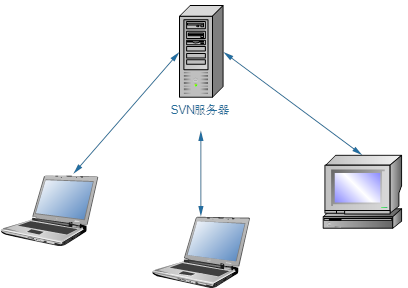

### 1.4.2. git

​	Git是**分布式版本控制系统**，它没有中央服务器，每个人的电脑就是一个完整的版本库。

当需要和别人分享文件时时，再联网即可。

**关键字**:

- 分布式

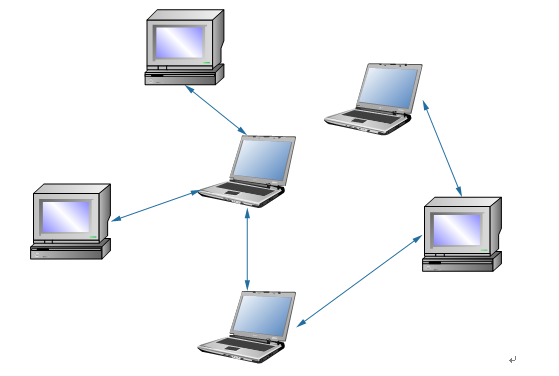


## 1.5. git 安装

​	Git可以在Linux、Unix、Mac和Windows这几大平台上正常运行使用。

[下载地址](https://git-scm.com/download)


​	安装成功后（windows下），在系统的任意目录下 点击 鼠标右键   出现以下菜单，代表安装成功。

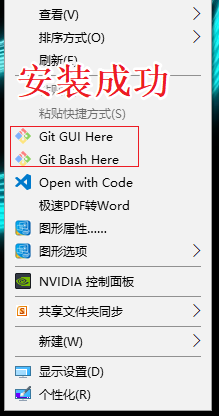

## 1.6. 初次运行 Git 前的配置

​	在团队的项目开发中，当我们对进行文件的修改时，都应该告诉服务器 是**谁**做的修改。所以 需要 配置个人信息。

### 1.6.1. 全局配置

​	打开 git 命令行工具   

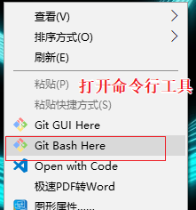

​	输入

```bash
# 配置 用户名
git config --global  user.name  xxx 

# 配置 邮箱
git config --global  user.name  xxx 

# 查看用户名
git config   user.name  
```


## 1.7. git 基础

​	如 我们想使用 git 对 该目录进行版本控制  

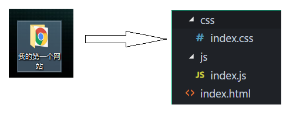

### 1.7.1. 创建版本库

​	在 `我的第一个网站` 目录 内   输入 `git init`  初始化 仓库 

```bash
git init 
```

​	可以看到，在该目录下 多了一个 **隐藏文件夹**  `.git`   该文件夹便是实现存放版本记录的地方。**不要手动修改！**

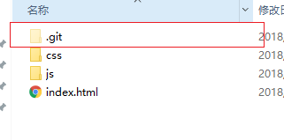

### 1.7.2. 添加到暂存区

​	现在我们的代码 和 git 仓库 还没有直接的联系  查看 git 仓库状态  输入 `git status`

```bash
git status
```

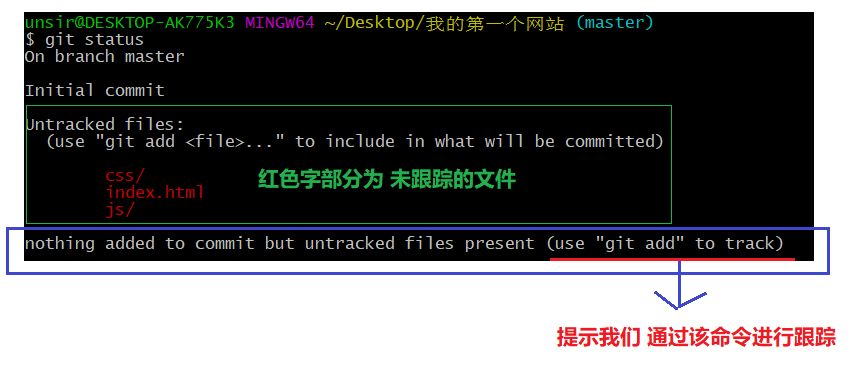

​	我们把添加跟踪的步骤，叫做 添加到 **暂存区**

​	输入  `git add *` 对所有文件进行跟踪

```bash
git add * 
```

​	此时，重新 查看 仓库状态

```bash
git status 
```

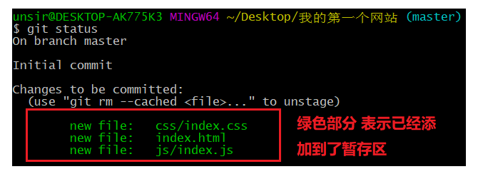

​	因此，我们可以 随时的  输入  `git status` 来查看当前仓库的状态，来获得 提示。

### 1.7.3. 提交本地仓库

​	暂存区的意思 只是暂时存储文件，当需要把对文件的操作 **永久存储下来时**，需要在把暂存区中的文件提交到到本地仓库。

​	输入以下命令进行提交，同时 还需要备注 信息 如 `初始化项目` 、 `新增了购物接口` 等。

```bash
git commit -m "初始化项目"
```

​	重新输入 `git status` 查看git 仓库状态 

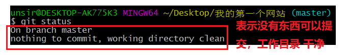

### 1.7.4. 小结

​	把刚才操作的流程，换成专业的术语。

- 工作目录 ：刚才操作的文件夹   `我的第一个网站` 就称为 **工作目录**
- 暂存区 ： 是用来存放 对文件进行了 跟踪，但是还没有 提交到 **本地仓库** 的地方
- 本地仓库： 最终实现 文件版本管理的地方。


## 1.8. 修改文件

​	在上个操作的基础上，我们对文件进行修改，然后让 git 记录这次修改的操作。

编辑 `index.html` 文件 输入 

```html
<h1>完成了登录页面的设计</h1>
```

​	此 时 `index.html` 文件发生了修改  我们输入  `git status` 查看仓库状态 

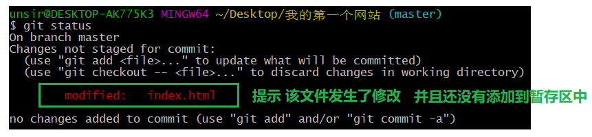

### 1.8.1. 添加到暂存区

​	以上的修改，可以理解为 完成了一个功能，此时，也需要将这些代码提交到 **本地仓库** 中进行记录管理。因此，先添加到 **暂存区** 再提交到 **本地仓库** 中即可。

​	将 修改的文件添加到 **暂存区**  输入 

```bash
git add *
```

​	查看git 仓库状态

```
git status
```

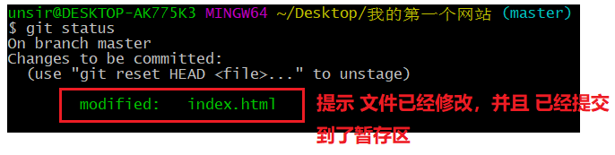


### 1.8.2. 提交到本地仓库

​	将暂存区中的文件提交的 本地仓库 实现 版本 记录

```bash
git commit -m "完成了登录功能"
```

​	查看git 仓库状态

```bash
git status
```

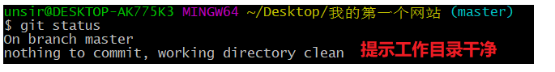


## 1.9. 删除文件

​	在git 仓库中，有时候删除一些无效的文件。以删除     `css/index.css` 为例

​	手动将该 文件夹整个删除     删除成功 如下 

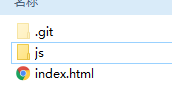

​	查看仓库状态

```bash
git status 
```

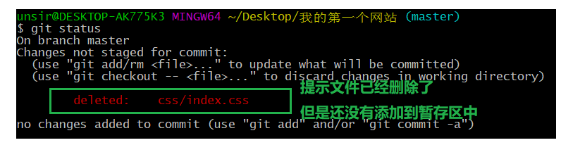

### 1.9.1. 添加到暂存区

​	删除了 文件，也可以了解为是对项目 进行了一次升级改造，因此同样需要把该 操作 提交到 **本地仓库**

​	输入    `git add ./`   请注意 当添加删除操作时  使用 `git add *` 是无效的。（git add * 不会缓存删除操作）

```bash
git add ./
```

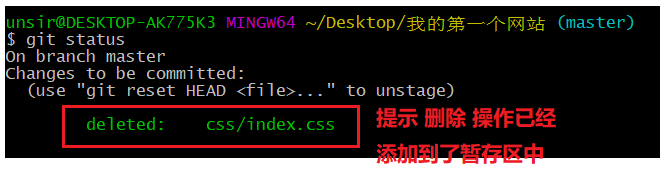

### 1.9.2. 提交到本地仓库

​	把该 删除操作 提交到 **本地仓库** 实现 版本记录

```bash
git commit -m "删除了css文件夹"
```

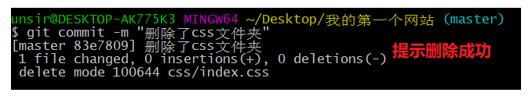

​	查本地仓库的状态

```bash
git status
```


## 1.10. 忽略文件

​	有时候，在工作目录下的某些文件，是属于私人的或者是项目运行所产生的临时文件，并不需要添加到 版本控制中。 如 新增一个文件 `私人密码`

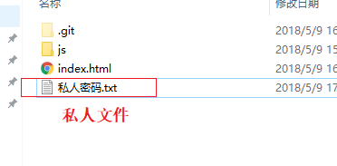

​	查看git仓库状态

```bash
git status
```

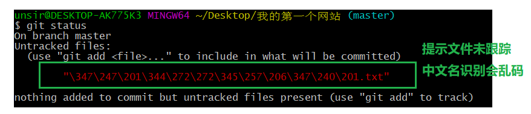

​	此时 我们可以使用 git 规定的一个文件   `.gitignore`   在里面指定需要过滤的文件

### 1.10.1. 创建 忽略文件清单

​	直接在windows 右键 新建文件  `gitignore`  会创建失败。

​	使用命令行的方式创建  

```bash
touch .gitignore
```

​	编辑   `.gitignore` 文件  直接写入 要忽略的文件名即可 

```bash
# 忽略该文件
私人密码.txt
```

​	查看git仓库状态 

```bash
git status
```

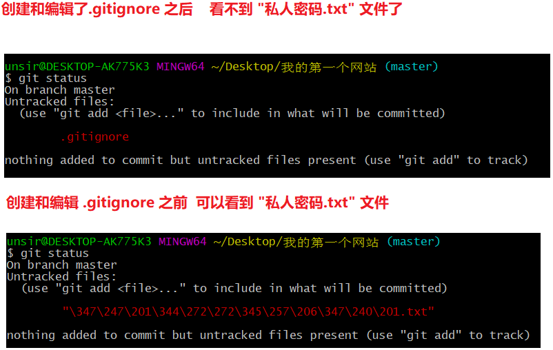


大部分情况下，我们也需要将 `.gitignore` 文件一起提交到本地仓库中实行版本控制

​	添加到暂存区   该文件 使用 `git add * ` 无效 需要手动指定文件名 

```bash
git add .gitignore
```

​	提交到本地仓库

```bash
git commit -m "添加了忽略文件列表"
```

### 1.10.2. 忽略文件语法

- 语法大部分和正则类似

- 空行或是以#开头的行即注释行将被忽略；

  ```bash
  # 这种是注释
  ```

- 以斜杠 “/” 结尾表示目录；

  ```bash
  css/
  ```

- 以星号 “*” 通配多个字符；

  ```bash
  *.js
  ```

- 以问号 “?” 通配单个字符

- 以方括号 “[]” 包含单个字符的匹配列表；

- 以叹号 “!” 表示不忽略(跟踪)匹配到的文件或目录；

- 可以在前面添加斜杠 “/” 来避免递归

  ```bash
  # 忽略根目录下的 css 文件夹
  /css
  # 忽略所有的css文件夹
  css/
  ```

  ​

## 1.11. 推送到远程仓库

因为在团队开发中，我们的项目文件是需要和组员进行分享的，所以实现这个功能，就必须得借助远程仓库。

远程仓库只是 本地仓库的一个备份。

目前 用得比较多的有 [github](https://github.com/) 和 [码云](https://gitee.com/)

- github做为最著名的git仓库托管商,是行业内的绝对权威.它给无数的开发者提供了共同学习发展的平台.
- 码云是github的国产版,对国人做了针对性的优化,在国内也是使用者众多

我们主要演示 **github**的使用，码云 **强烈建议** 课下 自己学习使用。

### 1.11.1. 注册 github

先注册一个 github帐号


### 1.11.2. 新建远程仓库

**1 一个github帐号可以建立多个远程仓库，一般 一个项目使用一个仓库。**


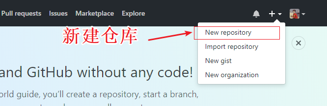


**2 填写仓库信息**


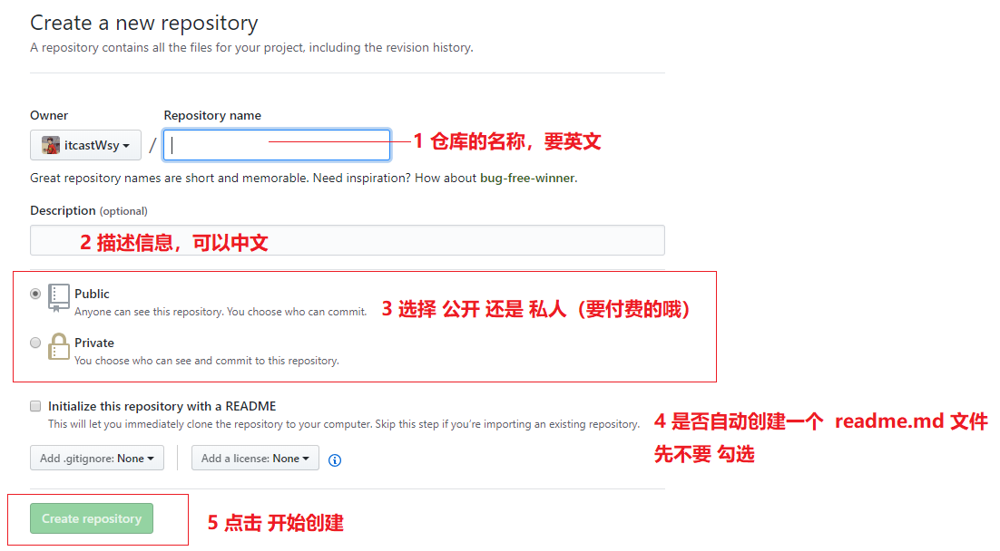


**3 创建成功**


### 1.11.3. 推送到远程仓库

​	远程仓库建立完毕之后，我们可以 将 之前的 本地仓库 `我的第一个网站` 推送到上面新建的 `test` 远程仓库上

​	先记录远程仓库的地址

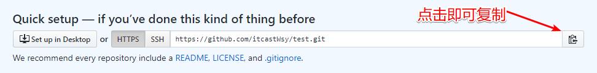

```bash
https://github.com/itcastWsy/test.git
```

​	把远程仓库 记录在一个 变量   `origin ` 上  该名字可自定义

```bash
git remote add origin https://github.com/itcastWsy/test.git
```

​	在推送到远程仓库之前，先确保 本地仓库已经 执行过 commit 了，这样 才会保证 本地仓库 和远程仓库一致。

​	查看本地仓库状态  

```bash
git status
```

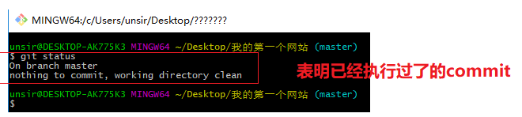

​	开始推送

```bash
git push -u origin master
```

​	提示输入用户名 ，直接输入即可 如 ` itcastWsy`  然后按下回车  

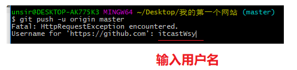

​	提示输入密码

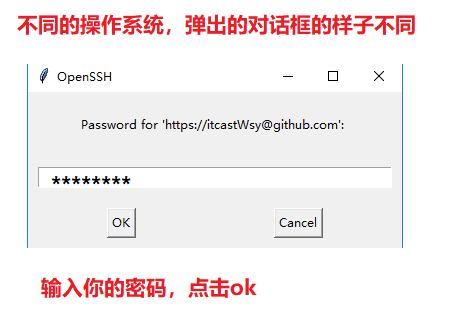

没有看到报错，就是 推送成功

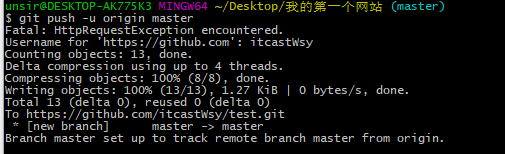

同时，刷新一下 **github** 页面  看到远程仓库上 显示出 仓库的信息了。

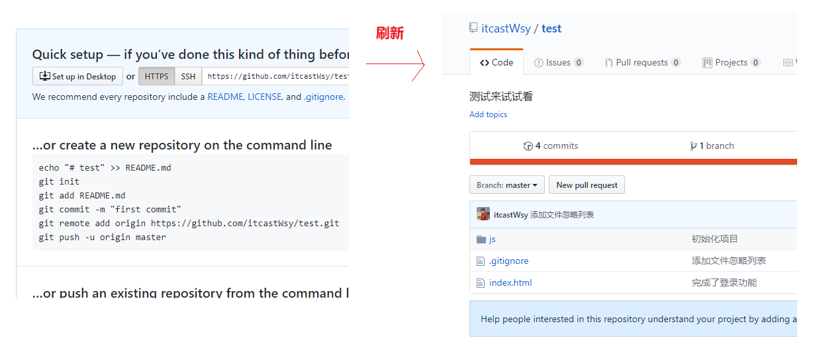

## 1.12. 从远程仓库克隆

​	假设 **建立本地仓库**、 **推送到远程仓库** 的工作都是项目经理完成了。此时，你做为一个新加入项目的 **程序猿**，要做的事就是从远程仓库上 **克隆** 代码。

​	问项目经理拿 远程仓库的地址

```bash
https://github.com/itcastWsy/test.git
```

​	在你的电脑上任意目录下（如 桌面） 开始克隆 

​	在桌面上 打开 **git bash 命令行工具**  输入

```bash
git clone https://github.com/itcastWsy/test.git
```

 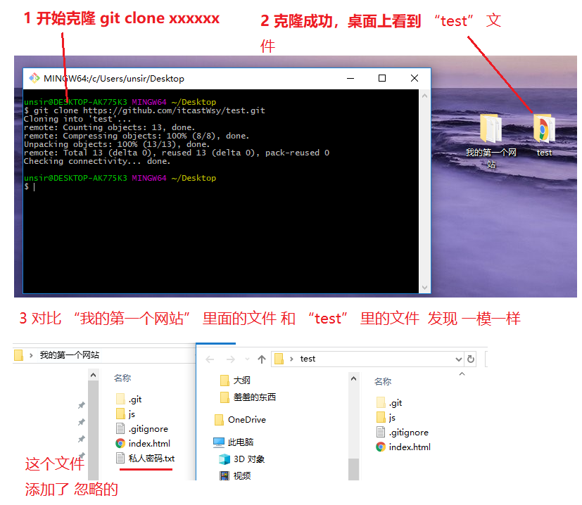


## 1.13. 从远程仓库获取更新

​	此时，项目经理的代码  和 你的代码 是一模一样的。现在 项目经理 新增了一个文件   `home.html`,并把它提交到远程仓库上。

- 新建 home.html 文件

  ```bash
  touch home.html
  ```

- 添加到暂存区

  ```bash
  git add *
  ```

- 提交到本地仓库

  ```bash
  git commit -m "新增了home.html"
  ```

- 推送到远程仓库

  ```
  git push 
  ```

  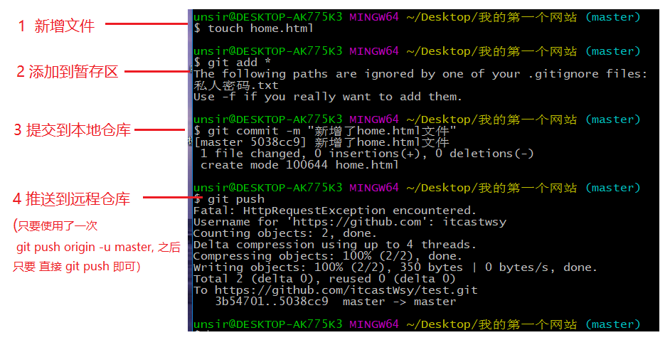


​	查看远程仓库

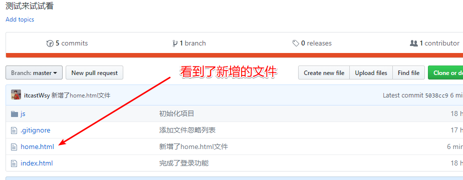


​	那么现在 做为程序员的你 需要把代码 进行更新   

​	回到   `test` 文件夹内，打开 **git bash** 命令行

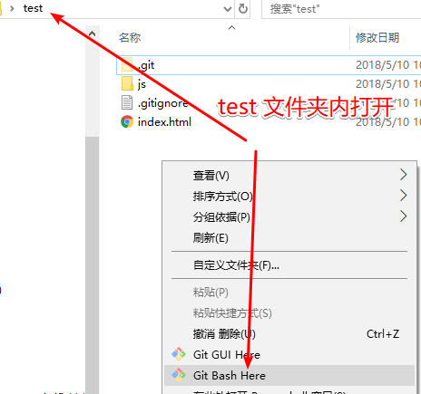

输入以下命令 进行更新

```
git pull
```

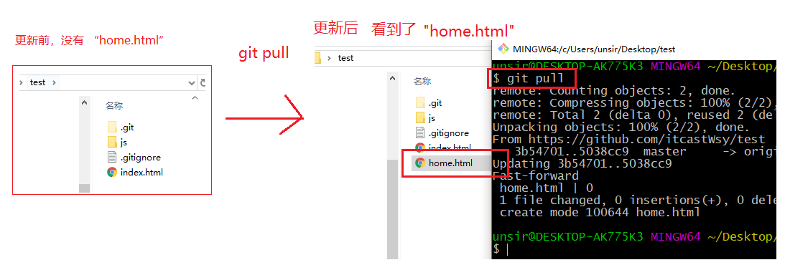

## 1.14. git clone 和 git pull 的区别

- git clone 是克隆，只需要执行一次
- git pull 是 更新，后期反复使用


## 1.15. 还原文件到上次commit状态

​	假设做为程序员的你，刚刚把代码更新下来，便上厕所去了，这个时候你的熊孩子趁你不在，对着你的键盘就是一顿 啪啪啪 ，把你 **home.html**  文件敲得面目全非。

​	你现在想要做的事，就是把 **home.html** 还原到 拉取下来的状态。

​	原来的home.html 内容是空的。（你是不知道里面的内容的）

​	熊孩子 把 **home.html** 改成了

```html
<h1>钱多话少死的早</h1>
```

​	开始还原，在   `test` 目录下，输入命令行

```bash
git checkout  home.html
```

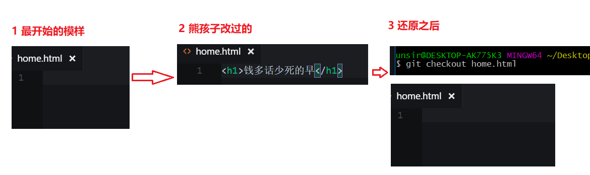

​	如果想要还原多个文件，可以

- 还原文件夹 css 文件夹

  ```
  git checkout css
  ```

- 还原当前目录的所有文件 

  ```
  git checkout ./ 
  ```

  ​

## 1.16. 查看版本历史

​	做为 新加入项目的你，想要了解 这个项目，到底做过了哪些版本，想要看到之前每一次提交时的备注信息 

此时，你的 `test` 文件夹内  输入 命令进行查看

```bash
git log
```

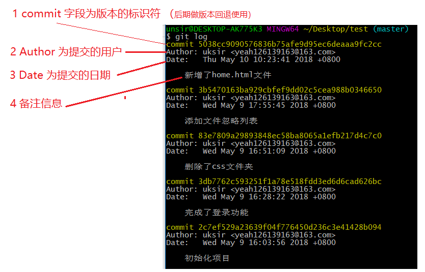


## 1.17. 还原到某一个版本

​	做为 新加入项目的你，来获取了最新的代码之后，发现项目太大了，你不好去学习和了解 其中的某一个模块的功能和代码。如

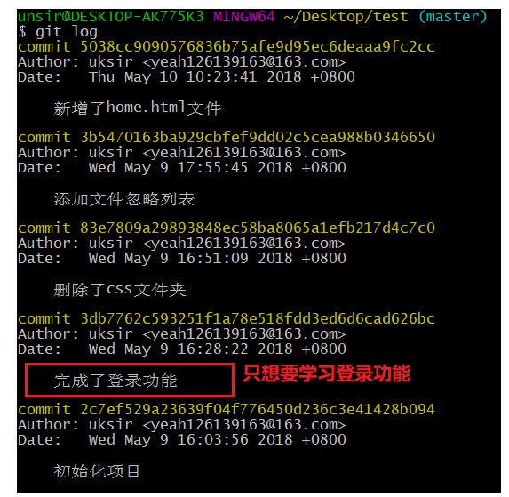

此时，可以把整个项目 还原到 **完成了登录功能的状态**

​	记录 该版本的   `commit` 字段

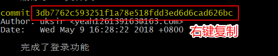

​	

```
3db7762c593251f1a78e518fdd3ed6d6cad626bc
```

 	开始还原   （commit 字段 最少 写 6位）

```bash
git reset -–hard 3db7762c593251f1a78e518fdd3ed6d6cad626bc
```

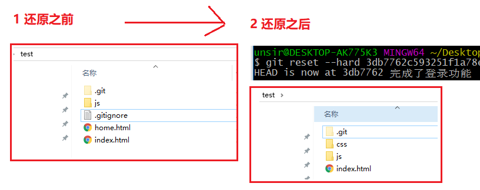


​	如果，在次状态下又想回到 最新的版本  **新增了home.html** 呢  查看提交信息

```
git log
```

​	发现   `完成登录功能` 之后的日志信息 丢失了。


​	此时，输入 

```bash
git reflog 
```

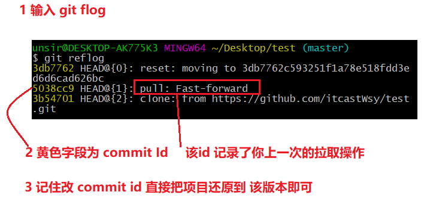

​	还原到最新的版本

```
git reset --hard 5038cc9
```

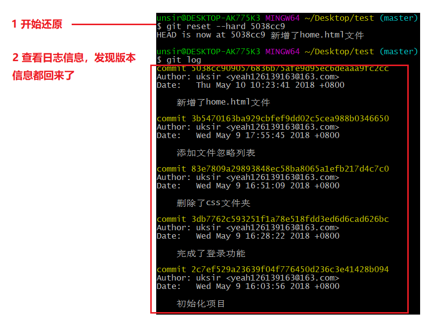

### 1.17.1. 小结

- `git checkout xxx` 只能还原文件到上一个版本
- `git reset --hard 'commit的id'` 可以还原到任意版本
- `git reflog` 可以查看丢失了的版本的日志信息


## 1.18. 配置ssh

​	我们把文件从本地仓库推送到远程仓库的方式有两种

- HTTPS 每次都要手动输入 用户名和密码 
- SSH 配置证书后，不用手动输入用户名和密码

### 1.18.1. 配置证书

在git bash 命令行中输入  

```bash
ssh-keygen -t rsa -C "邮箱地址"
```

然后一直按回车。直到出现如下界面 代表本地 证书生成成功

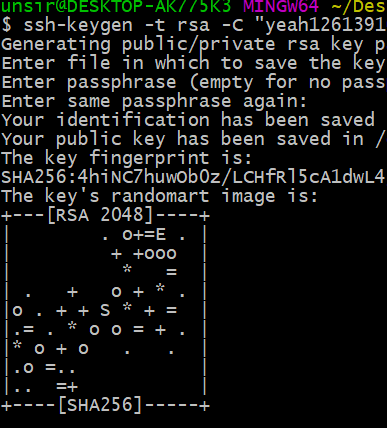

输入命令 打印密钥

```
cat ~/.ssh/id_rsa.pub
```

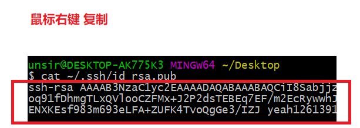

按以下步骤进行粘贴即可

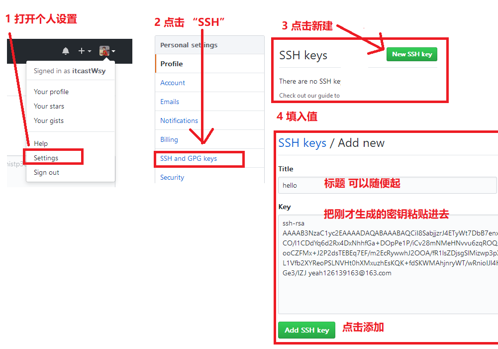


输入

```bash
ssh -T git@github.com
```

出现以下界面代表成功。如果失败，建议多尝试几次。

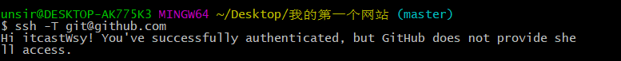


### 1.18.2. 将提交方式 HTTPS   改为 SSH

复制 **SSH** 地址

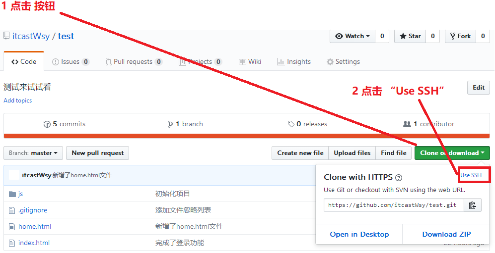

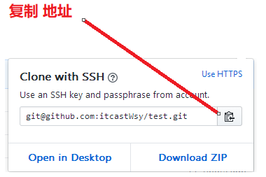

```
git@github.com:itcastWsy/test.git
```

修改 **origin** 地址 

因为之前已经将 地址 存入 **origin**  变量了 。查看 origin

```bash
git remote -v
```

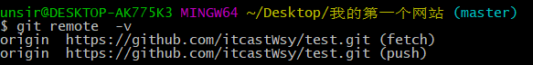

此时，将origin的地址 改为 **ssh** 地址即可

```bash
git remote set-url origin git@github.com:itcastWsy/test.git
```

重新查看 `git remote -v`   发现修改成功

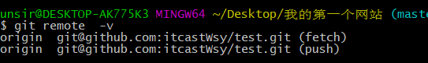


按照以上步骤执行完毕之后，再次推送到远程仓库时，就不用再输入用户名和密码了。

测试 

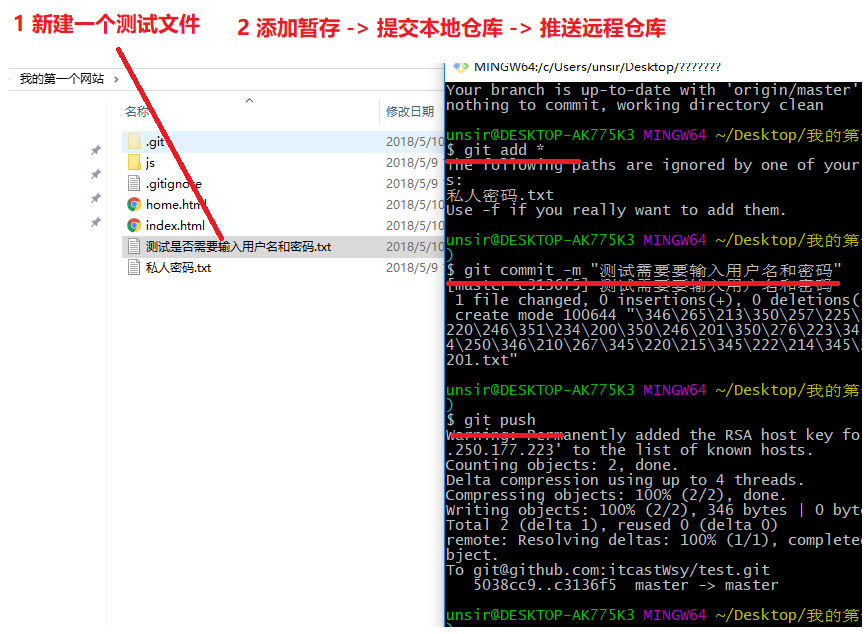


## 1.19. 分支

​	其实我们在使用git的时候，一直在 git的主分支`master`也是默认分支下进行工作的。也可以手动开启另外的分支进行开发。

​	开启新的的分支时可以理解为复制了一个相同的副本.内容完全一样

​	分支的作用是提供了一种方便、高效的管理项目的手段。

​	学习分支,我们需要从需求入手

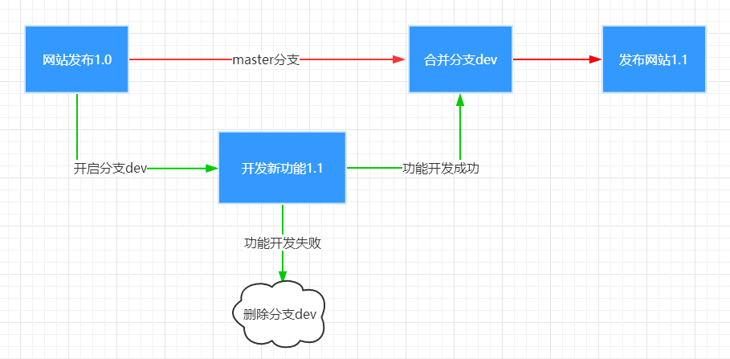

​	流程解释:

1. 网站发布了第一个版本

2. 此时,需要研发新功能1.1版本

3. 开启新的分支`dev`进行研发

   1. 研发成功，将分支`dev`合并到主分支`master`上,发布新版本1.1
   2. 研发失败，直接删除分支`dev`即可

   经过以上流程,我们可以在毫无风险的情况下开发新功能,不会影响到已经发布了的网站。

### 1.19.1. 网站发布0版本

在目下下,新建文件夹 `web`，并在里新建一个空的文件`index.html` 提交到本地仓库

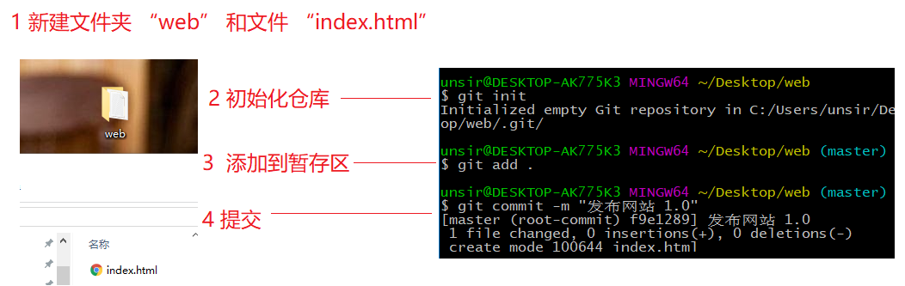

### 1.19.2. 开启新分支

​	在完成1.0版本发布后（commit之后），开启新分支 dev（dev为分支名）

```bash
git branch dev
```

​	查看当前仓库下的分支

```bash
git branch 
```

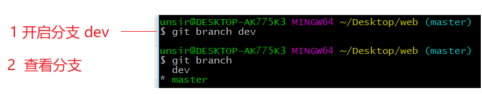

### 1.19.3. 切换分支

​	此时，需要手动切换分支到dev上，

```bash
git checkout dev
```

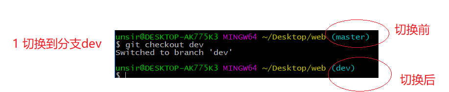

### 1.19.4. 在分支dev上开发功能

​	此时，我们可以在分支dev上，放心的进行功能开发。编辑文件 `index.html` 添加一下内容 

```
开发新功能1.0
```

​	提交到仓库

```bash
git add .
git commit -m "dev下开发新功能1.1"
```

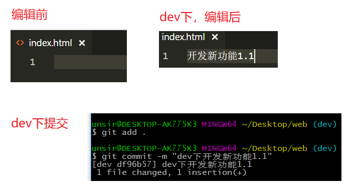

### 1.19.5. 合并分支

​	新功能开发完毕，需要将分支`dev`的代码合并到主分支`master`上

1. 切换回主分支 `master`

   ```bash
   git checkout master
   ```

2. 合并分支 `dev`

   ```bash
   git merge dev
   ```

   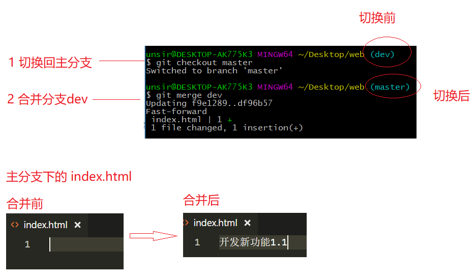

### 1.19.6. 删除分支

既然 分支dev的功能已经完成，我们可以将其删除。

```bash
git branch -d dev
```

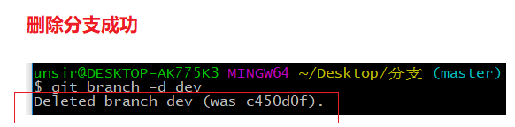

查看git仓库下的分支，发现 分支dev 确实没有了

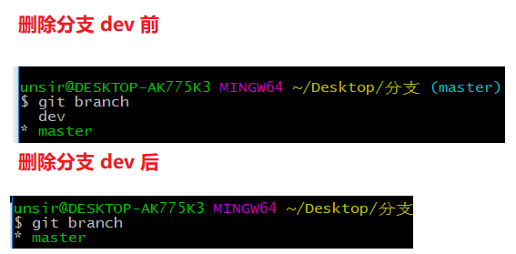

## 1.20. 冲突

​	冲突是指当两个同名的文件进行合并时，会产生的一种场景。

### 1.20.1. 冲突描述

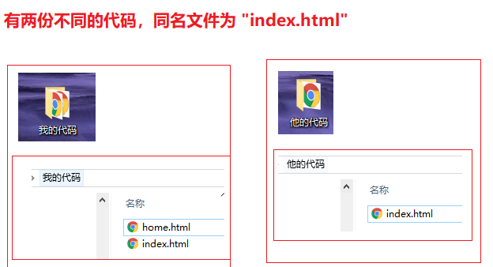

​	当把       `我的代码`内的两个文件 拷贝到 `他的代码` 文件夹内时 

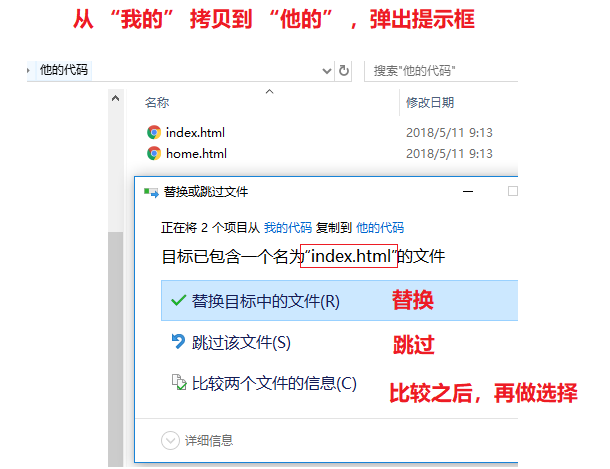

​	可以看到此时，冲突就产生了 因为电脑并不知道 你想要保留哪一份   `index.html` 文件（**home.html**没有冲突） ，于是，弹出对话框，让用户进行选择。

​	所以冲突具有以下特点

- 在文件进行合并时容易产生
- 冲突的解决方法，只能是用户决定


## 1.21. 分支合并时的冲突

​	刚才的演示，是人为手动操作导致的。当我们使用分支，进行合并的时候，也会出现冲突，只不过这次冲突的 **提示框** 和 **解决方法** 都是通过 **命令行**来体现的。

### 1.21.1. 初始化仓库

1. 新建一个文件夹 `冲突的演示`
2. 初始化 git 仓库 `git init`
3. 新建文件 `index.html`
4. 添加到暂存区 
5. 提交到本地仓库

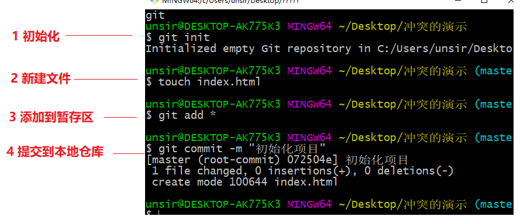

​	

### 1.21.2. 开启 分支 dev

​	初始化完仓库之后，开启分支dev，此时 分支dev 的内容和主分支master 是一模一样的

```bash
git branch dev
```

​	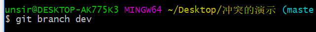

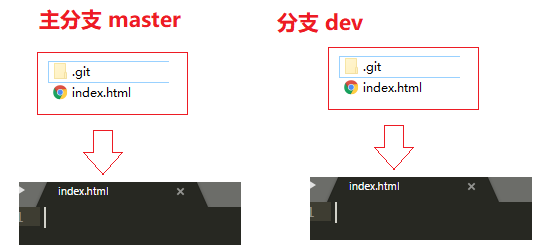

​	在分支master下，

1. 编辑 **index.html**  输入  `主分支master下的编辑`
2. 添加到暂存区 `git add *`
3. 提交到本地仓库 `git commit -m "master下修改了index.html"`

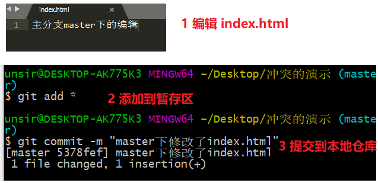

​	切换到 分支 dev下

1. 切换分支 `git checkout dev`

   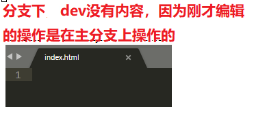

2. 编辑 **index.html**  输入  `分支dev下的编辑`

3. 添加到暂存区 `git add *`

4. 提交到本地仓库 `git commit -m "dev下修改了index.html"`

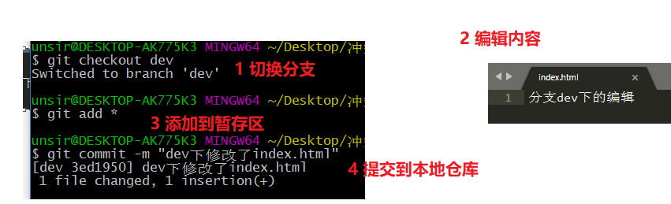


完成了以上操作之后，主分支**master**和 分支**dev** 下的index.html 分别是

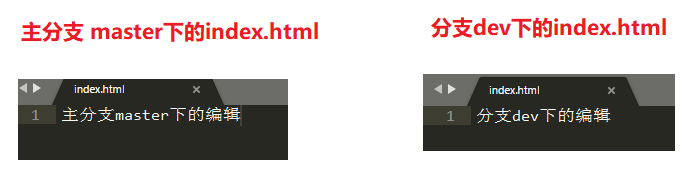


### 1.21.3. 合并冲突分支以及解决

此时准备分支合并，

1. 切换回主分支 `git checkout master`

2. 执行合并 `git merge dev` 弹出提示 **文件合并产生冲突了**

   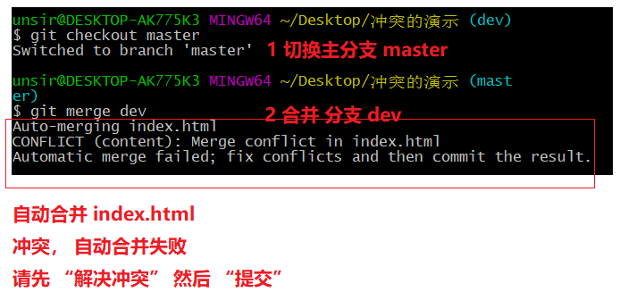

3. 此时，手动解决冲突，打开 `index.html` 文件 发现 

   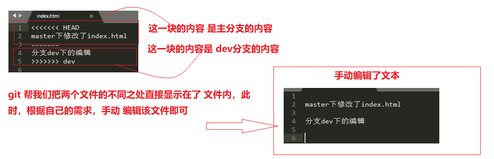

4. 添加到暂存区 

5. 提交到本地仓库 

   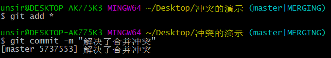


至此，冲突的产生以及解决，演示完毕。 强烈建议  自行多练习该步骤，了解每一步的含义。


## 1.22. 常用git命令

| 注解                                       | 命令                                |
| ------------------------------------------ | ----------------------------------- |
| git reset HEAD XXX                         | 从暂存区移出                        |
| git diff                                   | 查看编辑过的文件和 版本库的区别     |
| git config user.name xxx                   | 配置当前仓库的用户名                |
| git config user.email xxx                  | 配置当前仓库的邮箱                  |
| git init                                   | 初始化 git 仓库                     |
| git add xxx                                | 添加到暂存区                        |
| git commit -m "备注"                       | 提交到本地仓库                      |
| git commit -m "备注" -a                    | git add  和 git commit 的综合       |
| git remote -v                              | 查看远程仓库地址                    |
| git remote add 远程仓库名  远程仓库地址    | 添加远程仓库地址                    |
| git remote rm 远程仓库名                   | 删除远程仓库                        |
| git remote set-url 远程仓库名 远程仓库地址 | 修改远程仓库地址                    |
| git push 远程仓库地址 master               | 提交到远程仓库                      |
| git push 远程仓库地址 master -u            | 提交到远程仓库 (以后 git push 即可) |
| git clone 远程仓库地址                     | 克隆仓库                            |
| git pull                                   | 拉取更新                            |
| ssh-keygen -t rsa -C "邮箱地址"            | 生成 ssh证书                        |
| cat ~/.ssh/id_rsa.pub                      | 查看ssh证书                         |
| git reset --hard "commit Id"               | 还原到某版本                        |
| git reset --hared HEAD^                    | 还原到上一个版本                    |
| git log                                    | 查看版本历史                        |
| git reflog                                 | 查看更强大的版本历史                |
| git checkout 文件名                        | 还原文件到上一个版本                |
| git branch 分支名                          | 创建分支                            |
| git checkout 分支名                        | 切换到分支                          |
| git merge 分支名                           | 合并分支                            |
| git branch                                 | 查看分支                            |
| git branch -d 分支名                       | 删除分支                            |
|                                            |                                     |

## 1.23. 扩展阅读

[Pro Git](https://progit.bootcss.com/)

[猴子都能看懂的git](https://backlog.com/git-tutorial/cn)

[十分钟掌握bash 命令](https://www.cnblogs.com/savorboard/p/bash-guide.html)

