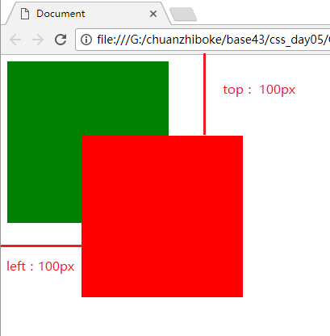
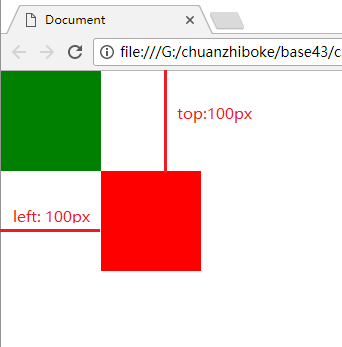
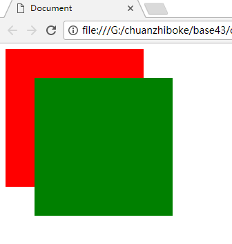

# 一、定位基础

## 1.1 定位的作用
1) 吸引用户眼球
2) 方便交互
3)并非用来布局,仅仅是盒子的小修饰。
4)一个盒子可以自由的摆放,且可以压在其他盒子上面。


## 1.2 定位的语法
定位的概念：定位 = 定位模式 + 边偏移

**1)边偏移**
在 CSS 中，通过 `top`、`bottom`、`left` 和 `right` 。

**2)定位模式**
在 CSS 中，通过 `position` 属性定义元素的**定位模式**，语法如下：

**3)语法**
```css
选择器 { position: 属性值; }
```
| 值          |    语义    |   关键词   | 描述                      |
| ---------- | :------: | :-----: | ----------------------- |
| `static`   | **静态**定位 | **不定位** | 所有元素的默认定位方式。            |
| `relative` | **相对**定位 | **自恋**  | 相对于其**原标准流的位置**进行定位     |
| `absolute` | **绝对**定位 | **拼爹**  | 相对于其上一个**已经定位的父元素**进行定位 |
| `fixed`    | **固定**定位 | **浏览器** | 相对于**浏览器窗口**进行定位        |

## 1.3 静态定位(static)
**静态定位**是元素的默认定位方式，也就是说网页中**所有元素**默认**都是静态定位的** 。按照标准流即可。

## 1.4 相对定位(relative)
**定：**以自己的左上为坐标原点开始定位。
**位：**自身盒子位置保留。


示例：
```css
/* 红色盒子相对定位移走后,仍然保留位置,绿色盒子位置不会改变。 */
.box1 {
			width: 200px;
			height: 200px;
			background-color: red;
			position: relative;
			top: 100px;
			left: 100px;
		}

		.box2 {
			width: 200px;
			height: 200px;
			background-color: green;
		}

    <div class="box1">
	</div>

	<div class="box2">
	</div> 
```
## 1.5 绝对定位(absolute)
**定：**
- 如果父类有定位(相对/绝对)以父类为参考坐标。

- 如果父类没有定位,以浏览器为参考坐标(基准点对齐)。

**位：**
  不保留自身盒子的位置。



示例：
```html
/* 红色设置绝对定位后不保留自身位置,绿色位置自动上去。 */
.box1 {
			width: 200px;
			height: 200px;
			background-color: red;
			position: absolute;
			top: 100px;
			left: 100px;
		}

		.box2 {
			width: 200px;
			height: 200px;
			background-color: green;
		}
		
<div class="box1">
	</div>

	<div class="box2">
	</div>
```


## 1.6 固定定位(fixed)

定：以浏览器(可视区)为参考坐标,无论是否有父类盒子。
位：不保留自身盒子的位置。


```html
/* 如果没有定位,那么红色在上边,绿色在下边。
   固定定位后,红色盒子以浏览器为参考开始定位置,并且自身位置没有了,
   于是绿色盒子就上去了 
*/
.red {
			width: 100px;
			height: 100px;
			background-color: red;
			position: fixed;
			top: 100px;
			left: 100px;
		}

		.green {
			width: 100px;
			height: 100px;
			background-color: green;
}

    <div class="red">
	</div>
	<div class="green">
	</div>
```


# 二、定位扩展
## 2.1 绝对定位的居中

绝对定位不能通过设置 `margin: auto` 设置**水平居中**。但不影响通过margin+方位名词设置外边距。(**因为绝对定位不保留位置,所以此时左右的auto不起左右,与之类似的还有浮动,也不能通过 "margin: auto"设置水平居中,因为只能右漂移**)


设置水平居中如下,垂直居中与之类似。
```css
1. left: 50%;：让盒子的左侧移动到父级元素的水平中心位置；
2. margin-left: -100px;：让盒子向左移动自身宽度的一半。
```

## 2.2 堆叠顺序(z-index)
对于'绝对定位''不保留自身位置,可能会出现盒子重叠的情况。如下所示：

```css
/* 1)绿色绝对定位的盒子与红色出现层叠 
   2)没有指定z-index属性则按照盒子出现的先后顺序,后来居上。
*/
.red {
      width: 200px;
      height: 200px;
      background-color: red;
      position: absolute;
    }
    .green {
      width: 200px;
      height: 200px;
      background-color: green;
      position: absolute;
      top: 50px;
      left: 50px;
    }
    
  <div class="red"></div>
  <div class="green"></div>
```
使用z-index属性可以定义层叠等级属性,调整盒子的堆叠顺序。
**z-index特性：**
- 属性值： 正整数、负整数或 0，默认值是 0，数值越大，盒子越靠上。
- 数字后面不能加单位。
- z-index 只能应用于相对定位、绝对定位和固定定位的元素，其他标准流、浮动和静态定位无效。

## 2.3 行内块元素特性
​        一个行内的盒子，如果加了浮动、固定定位和绝对定位，不用转换，就可以给这个盒子直接设置宽度和高度等。

## 2.4 定位小结
| 定位模式         | 是否脱标占有位置   | 是否可以使用边偏移 | 移动位置基准           |
| ------------ | ---------- | --------- | ---------------- |
| 静态static     | 不脱标，正常模式   | 不可以       | 正常模式             |
| 相对定位relative | 脱标，占有位置    | 可以        | 相对自身位置移动（自恋型）    |
| 绝对定位absolute | 完全脱标，不占有位置 | 可以        | 相对于定位父级移动位置（拼爹型） |
| 固定定位fixed    | 完全脱标，不占有位置 | 可以        | 相对于浏览器移动位置（认死理型） |

# 三、定位应用
## 3.1  盒子里的小装饰
如下图所示的应用场景，要实现在一个大盒子里有两个'<'和‘>’按钮的功能。


**分析布局：**
1)父盒子插入图片,两个小盒子实现两个箭头。
2)方向箭头叠加在其他图片上方，应该使用绝对定位，因为绝对定位完全脱标，完全不占位置。
3)父级盒子应该使用相对定位，因为相对定位不脱标，后续盒子仍然以标准流的方式对待它。
4)如果父级盒子也使用绝对定位，会完全脱标，那么下方的广告盒子会上移，这显然不是我们想要的。
5)父级要占有位置，子级要任意摆放，这就是子绝父相的由来。

## 3.2 轮播图
子绝父相。

## 3.3 应用总结
子绝父相:父亲要占有位置,子盒子随意摆放。
子绝父固：广告
子绝父绝:点击弹出的页面